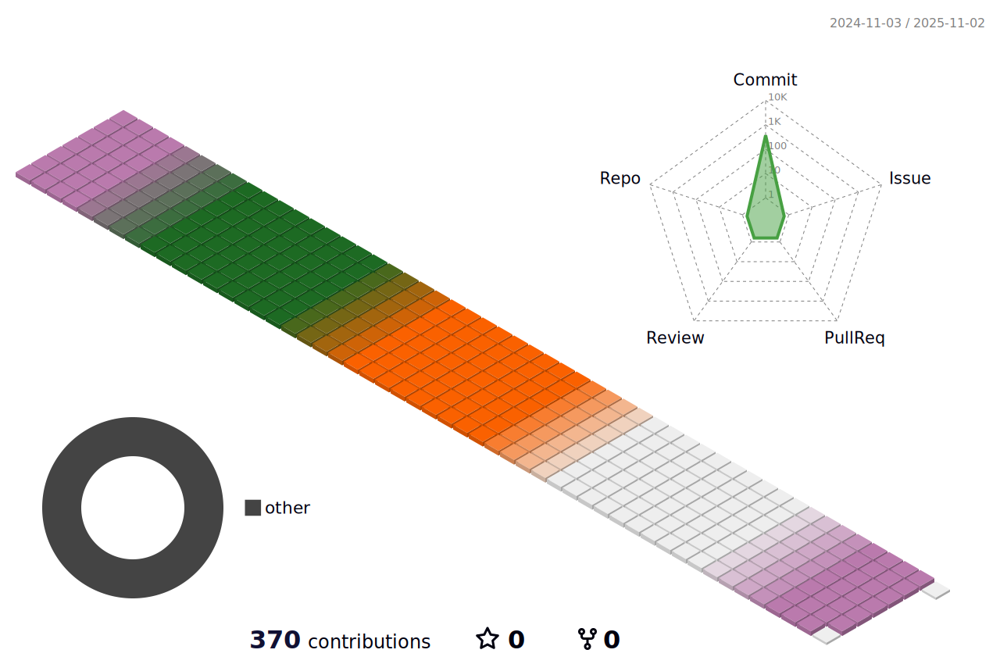

  

## 💻 Project

- [Humax Dreamverse Company Internship: Turu Parking](https://github.com/nakim81/Humax-Dreamverse-Company-Internship.git)
- [Food delivery service platform backend with Java and Spring boot](https://github.com/nakim81/Java-Delivery-Service-Platform-Backend.git)
- [Food delivery service platform backend with Kotlin, Java, and Spring boot](https://github.com/nakim81/Kotlin-Delivery-Service-Platform-Backend.git)
- [Game Walker(iOS)](https://github.com/nakim81/Game_Walker.git)
- [Campground review web page](https://github.com/nakim81/CampgroundWebPage-JavaScript.git)
- [Simple Java projects to study how to use API](https://github.com/nakim81/JavaStudy-HowToUseAPIs.git)
- [Simple Java projects](https://github.com/nakim81/JAVA-Projects.git)
- [Todo list app with React.js](https://github.com/nakim81/TodoList-React.git)

 

## ⌨️ Tech Stack

<Programing Languages\>

      

<Database\>

  

<Frameworks\>

  

<Cloud/Deploying>

    

<Experience With\>

MessagingSystem: 

Authentication:  

       

 

## 📊 Stats & Most Used Languages

 

## ✏️ Commit History

